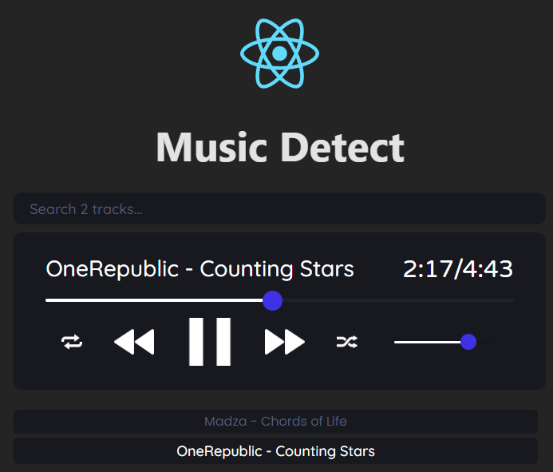
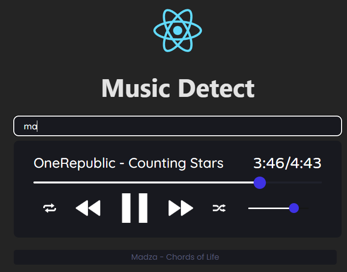

# Music Detect

Propuesta de proyecto.

Reproductor multimedia Web que muestra recomendaciones personalizadas 
en función del estado de ánimo del usuario. 
(El usuario define cómo se siente).

Especificación del proyecto:
- Inicio de sesión
- Carga de canciones local/remoto
- Funciones básicas de un reproductor: Sig, Prev, Play, Pausa, Volumen, Búsqueda de canciones.
- Recomendación de canciones (aceptar recomendación, generar una nueva).

Tecnologías de desarrollo (MERN Stack)
- React, JS
- IA: TensorFlow (tentativa)
- BD: Mongo

# Music Detect v1.0.0

Reproductor multimedia web el cual como se menciona en las especificaciones
sus funciones basicas son las de: Sig, Prev, Play, Pausa, Volumen, Búsqueda de canciones.

Al realizar alguna busqueda de alguna cancion, no se necesita escribir todo el nombre
simplemente con que incluya dichas letras muestra los posibles resultados.
